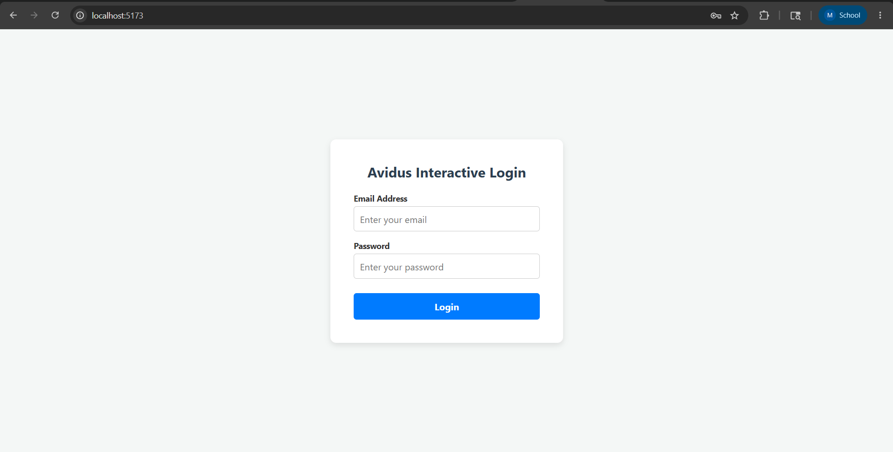
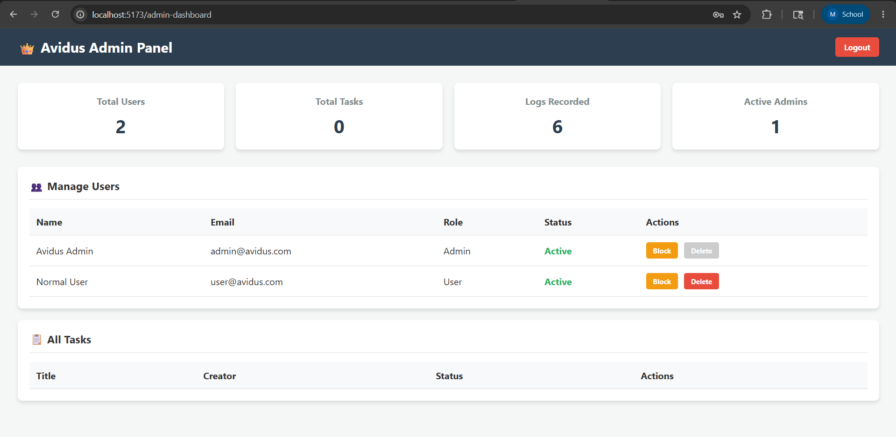
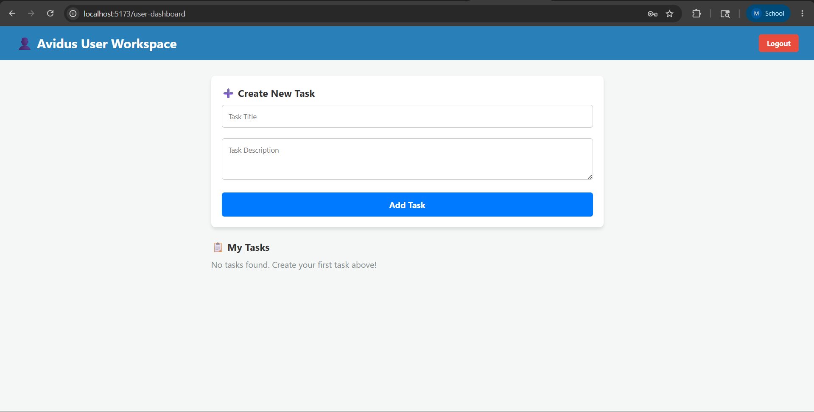

## Avidus Interactive - Task Management System

A full-stack, role-based task management web application built using the MERN stack (MongoDB, Express.js, React, Node.js). This project implements secure authentication, separate dashboards for Admins and Users, and complete CRUD operations for task management.

## **Key Features**

### **Authentication & Authorization**
* JWT-based secure authentication.
* Role-based access control (`Admin` vs `User` roles).
* Protected routes on both Frontend (React Router) and Backend (Express Middleware).

### **Admin Privileges (Admin Dashboard)**
* **Analytics Overview:** Real-time stats on total users, total tasks, and system logs.
* **User Management:** View all users, toggle their status (Active/Inactive), and delete user accounts.
* **Global Task Control:** Monitor all tasks across the platform and delete any task if necessary.

### **User Workspace (User Dashboard)**
* Dedicated clean UI for task management.
* **CRUD Operations:** Users can Create, Read, Update, and Delete their own personalized tasks.

---

## **Tech Stack**

* **Frontend:** React.js (Vite), CSS3, Axios, React Router Dom
* **Backend:** Node.js, Express.js
* **Database:** MongoDB (Mongoose)
* **Security:** JSON Web Tokens (JWT), Bcrypt.js

---

## **Local Setup & Installation Workflow**

Follow these steps to run the project locally on your machine.

### 1. Prerequisites
Make sure you have the following installed:
* [Node.js](https://nodejs.org/) (v16 or higher)
* [MongoDB](https://www.mongodb.com/) (Local instance or MongoDB Atlas cluster)

### 2. Clone the Repository
```bash
git clone https://github.com/mayank-7405/avidus-assignment.git
cd avidus-assignment
```

### 3. Backend Setup
Navigate to the backend directory, install dependencies, and configure environment variables.

```bash
cd backend
npm install
```

**Environment Variables:**
Create a `.env` file inside the `backend` folder and add the following required keys:
```env
PORT=5000
MONGO_URI=your_mongodb_connection_string_here
JWT_SECRET=your_super_secret_jwt_key_here
```

### 4. Database Seeding (Crucial for Testing)
To test the role-based dashboards, you need an Admin and a User account. Run the provided seeder scripts to automatically generate these test accounts in your database:

```bash
# Generates the Admin account
node seed.js

# Generates the Normal User account
node seedUser.js
```

### 5. Start the Backend Server
```bash
node src/server.js
```
*The backend server will start running on `http://localhost:5000`*

### 6. Frontend Setup
Open a **new terminal window/tab**, navigate to the frontend directory, install dependencies, and start the Vite development server.

```bash
cd frontend
npm install
npm run dev
```
*The frontend application will start on `http://localhost:5173`*

---

## Testing Credentials

Once both servers are running, visit `http://localhost:5173` and use the following credentials to test the application:

| Role | Email Address | Password | Access Level |
| :--- | :--- | :--- | :--- |
| **Admin** | `admin@avidus.com` | `admin123` | Full access, analytics, user & global task management. |
| **User** | `user@avidus.com` | `user123` | Personal workspace, own task CRUD operations only. |

---

## 📁 Folder Structure Overview

```text
├── backend/
│   ├── src/
│   │   ├── controllers/   # Request handlers (auth, tasks, admin)
│   │   ├── middleware/    # Auth and Role-check guards
│   │   ├── models/        # Mongoose schemas (User, Task, Log)
│   │   ├── routes/        # API route definitions
│   │   └── server.js      # Express app entry point
│   ├── .env               # Secret keys (Not tracked in Git)
│   ├── seed.js            # Admin account generator
│   └── seedUser.js        # Normal User account generator
│
└── frontend/
    ├── src/
    │   ├── pages/         # React Views (Login, AdminDashboard, UserDashboard)
    │   ├── App.jsx        # Route configuration
    │   └── App.css        # Global styles and responsive design
    └── vite.config.js     # Vite configuration (Proxy setup)
```

---

## Project Screenshots

**1. Login Page** 

**2. Admin Dashboard** (Role-based analytics and user management)  


**3. User Workspace** (Personalized task management)  


---